# Buddha Temple Maya Model

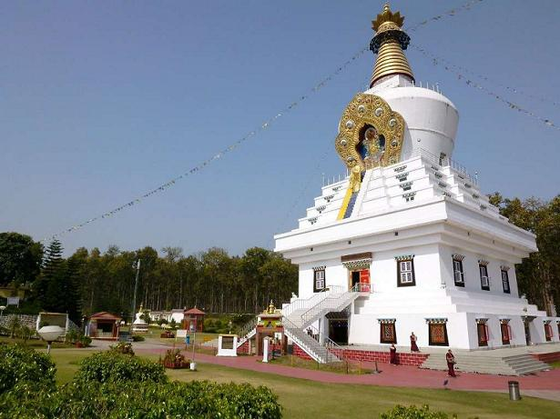

Welcome to the Buddha Temple Model repository! This repository contains a 3D model of the [Buddha temple](https://www.euttaranchal.com/tourism/buddha-temple.php) located in Uttarakhand, India. The model was created as a learning project to explore 3D modeling techniques using Autodesk Maya.

## About the Model

The Buddha temple model is a representation of the beautiful architecture found in Dehradun, India. It includes intricate details and designs inspired by traditional Buddhist temple architecture.

### Screenshots

Here are some screenshots of the model:

- 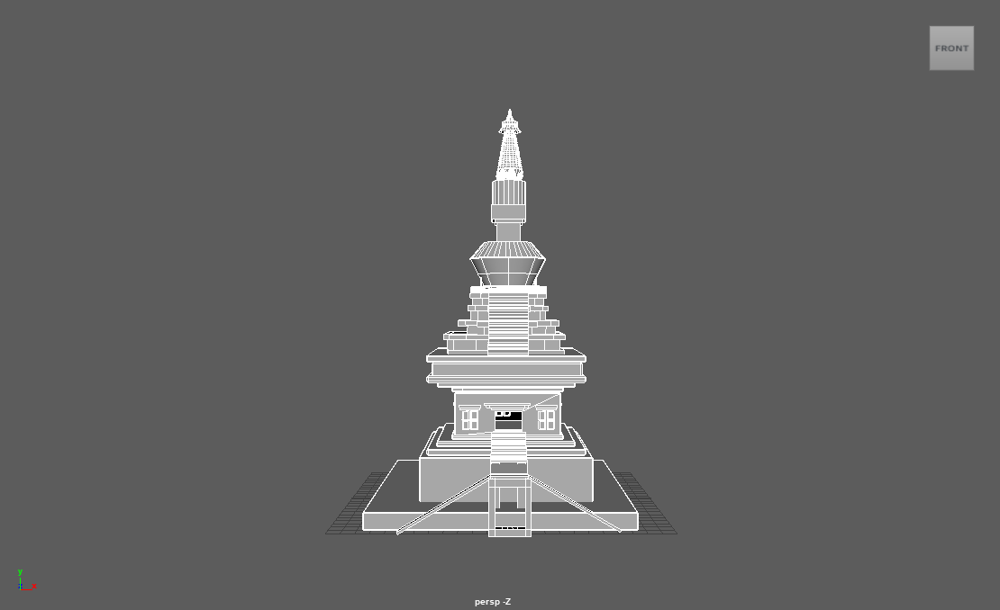
- 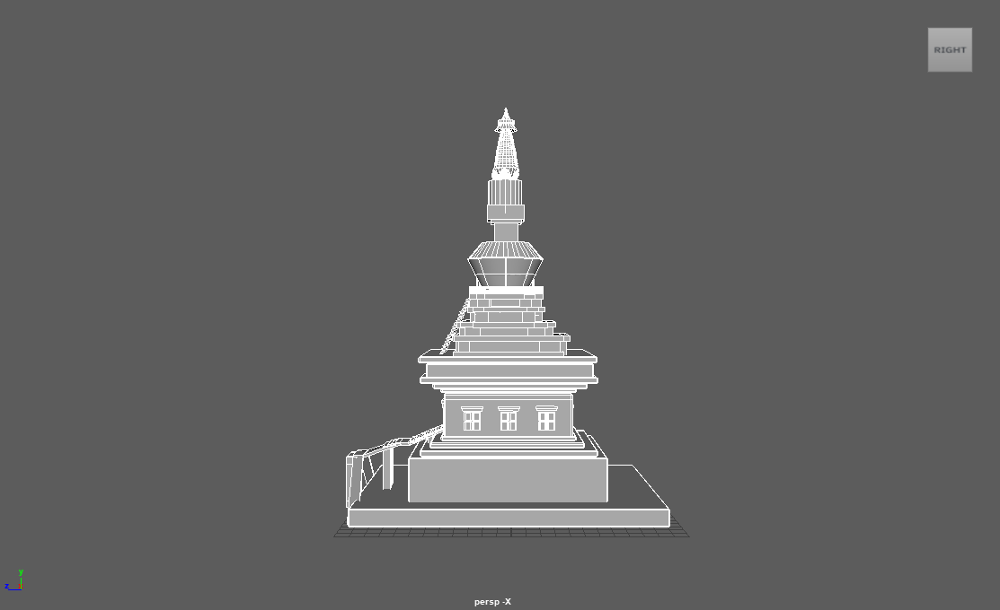
- 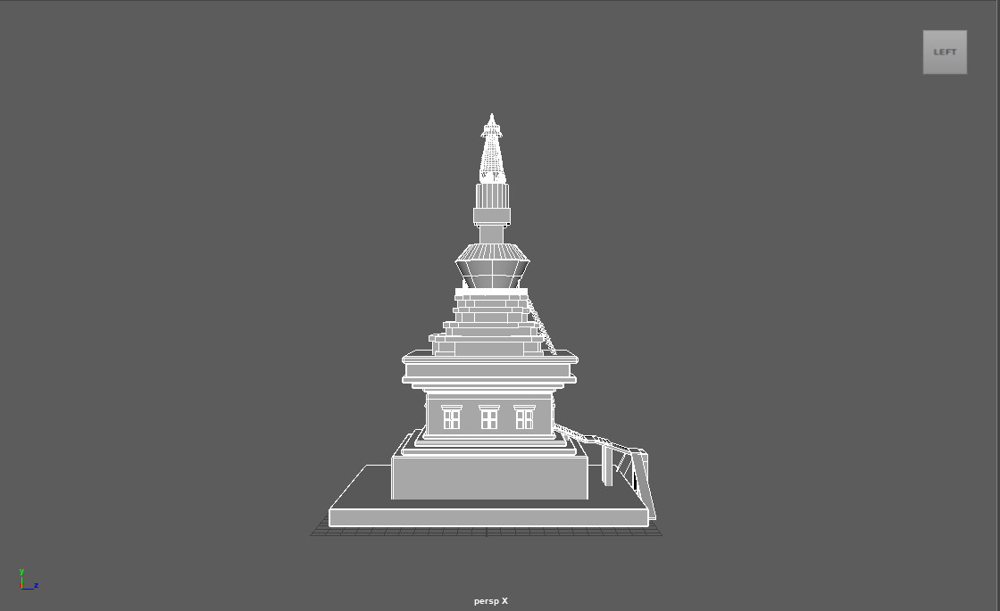
- 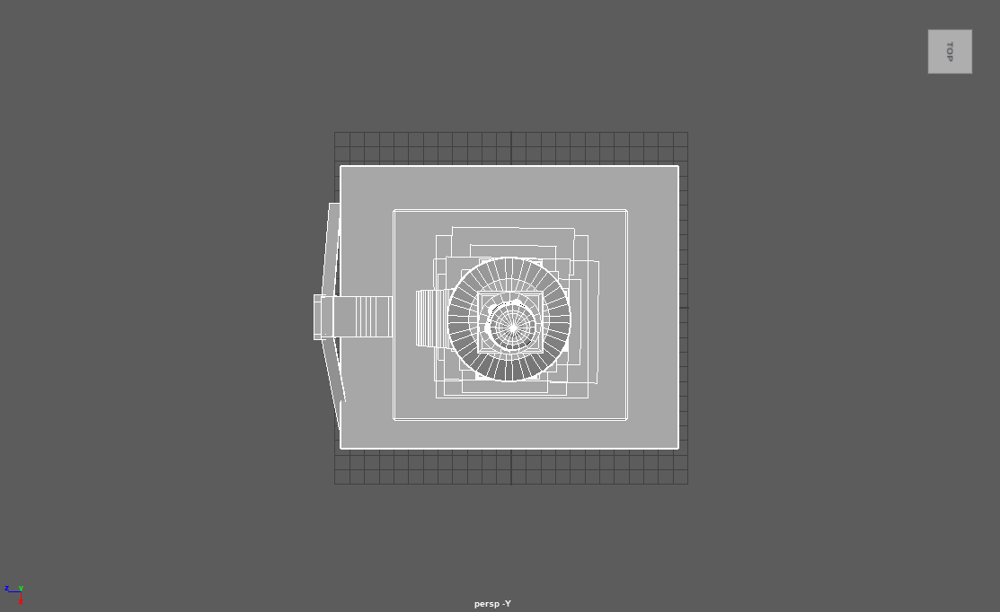
- 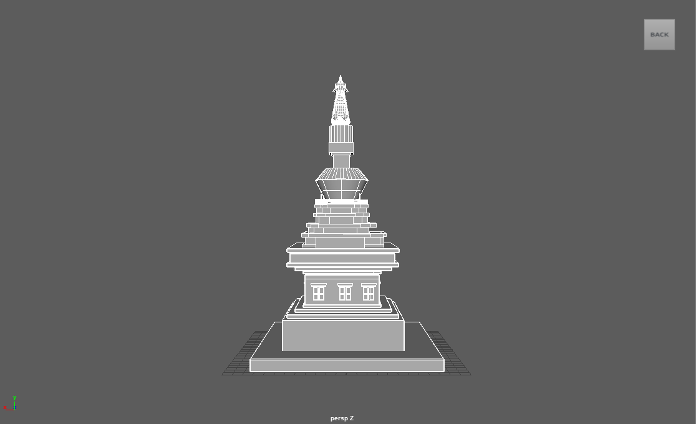

### Wireframes

Below are wireframe images of the model:

- 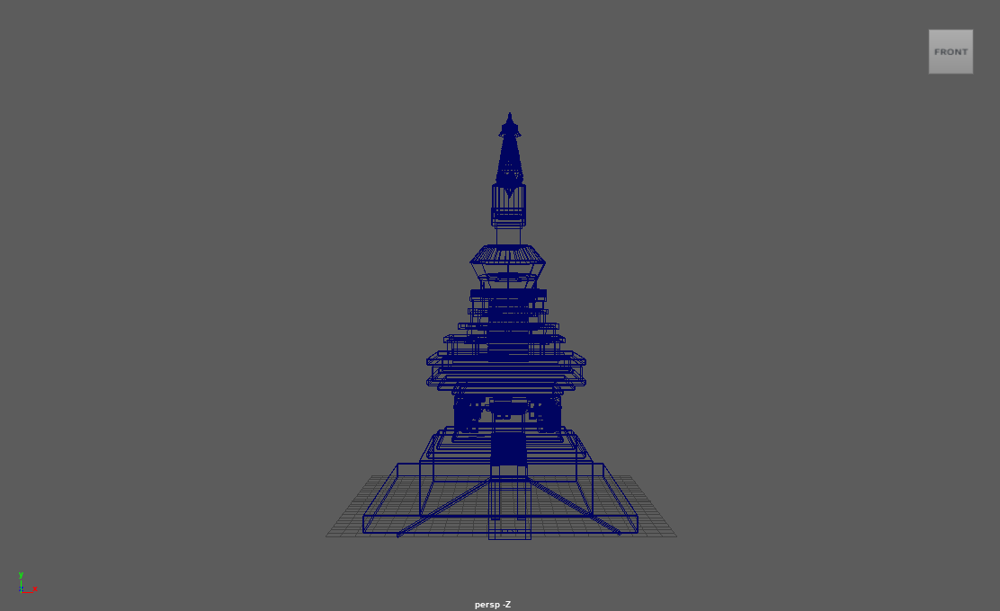
- 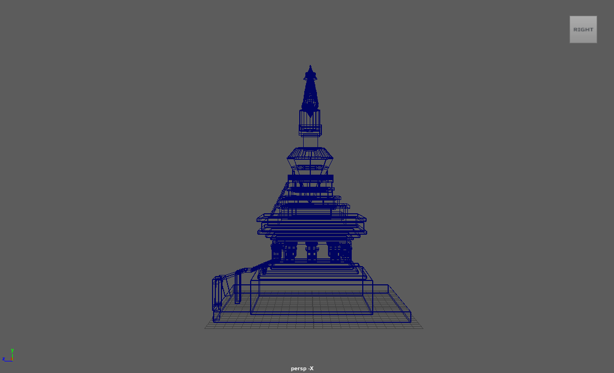
- 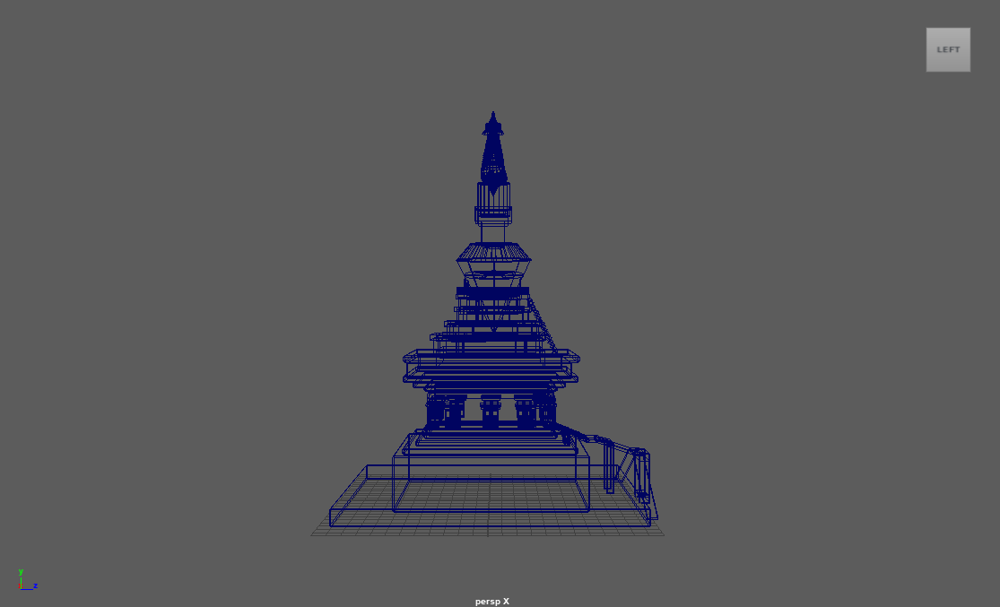
- 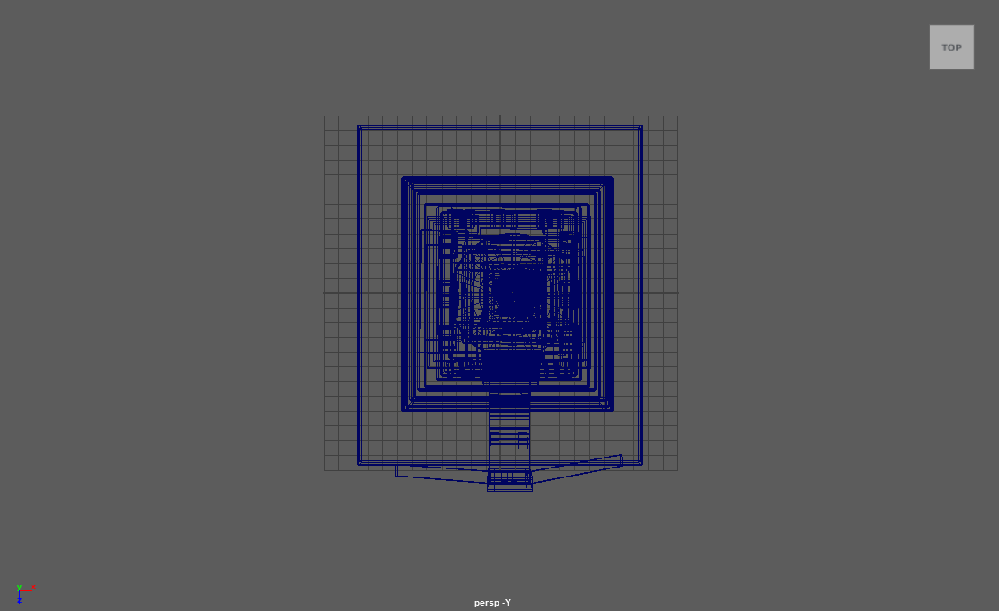
- 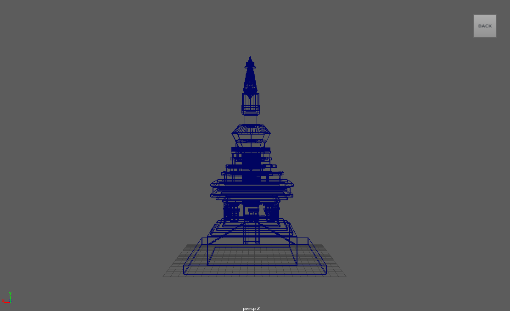

### Video

Check out this video showcasing the model:

## Usage

Feel free to explore the model and use it for your learning purposes. You can download the model files from the repository.

## Contributing

If you have any suggestions for improving the model or would like to contribute enhancements, please feel free to pull request.

## Source Files

The source files for the model are available in the parent repository:

- `Buddha_Temple.ma`
- `Buddha_Temple.mb`

